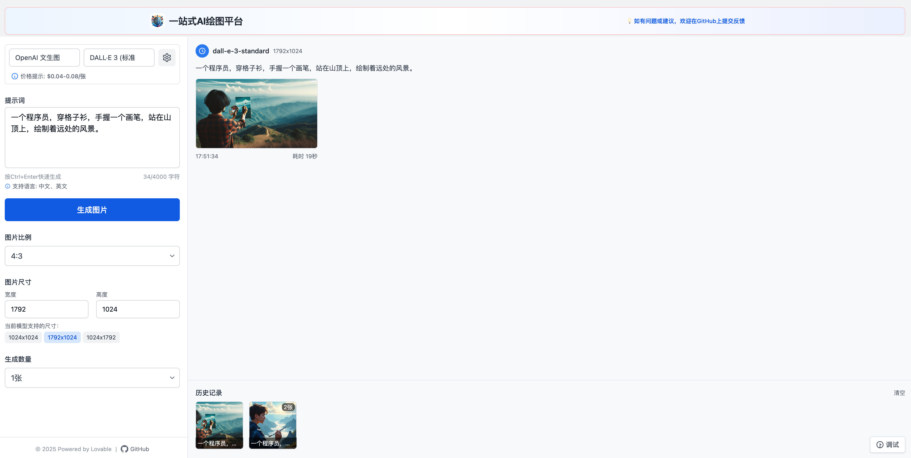

# PaintBot Hub

一个集成多个AI绘画平台API的统一操作界面工具，让创作变得更简单。



快速试用：[https://paintbot-hub.lovable.app/](https://paintbot-hub.lovable.app/)

## 功能特点

### 🛠 核心功能
- 文本生成图片(Text to Image)
- 支持中文、英文等多语言提示词
- 自定义图片尺寸和比例(支持4:3等多种比例)
- 批量生成多张图片(最多6张)
- 历史记录查看和复用

### 🎨 支持的AI平台
- [x] OpenAI 文生图
  - GPT-Image-1 (高/中/低质量)
  - DALL·E 3 (HD/标准质量)
  - DALL·E 2
- [x] 智谱AI CogView
  - CogView-4-250304
  - CogView-4
  - CogView-3-Flash
  - CogView-3
- [x] 百度千帆
  - irag-1.0
  - flux.1-schnell
- [ ] 阿里云通义万相（开发中）
- [ ] 火山引擎豆包（开发中）
- [ ] 腾讯云文生图（计划中）

### 💡 便捷特性
- 本地保存API密钥，确保安全性
- 生成历史记录保存
- 简洁直观的用户界面
- 实时生成状态显示
- 移动端适配支持

## 快速开始

### 环境要求
- Node.js 18+
- npm 或 yarn

### 安装步骤

1. 克隆项目
```bash
git clone https://github.com/kevin1sMe/paintbot-hub.git
cd paintbot-hub
```

2. 安装依赖
```bash
npm install
# 或
yarn install
```

3. 启动开发服务器
```bash
npm run dev
# 或
yarn dev
```

4. 在浏览器中访问 `http://localhost:8080`

## 使用指南

1. 首次使用需要配置API密钥
   - 点击设置图标
   - 输入对应平台的API密钥
   - 密钥会安全地保存在本地

2. 生成图片
   - 选择想要使用的AI模型
   - 输入图片描述文本
   - 选择图片尺寸和比例
   - 设置生成数量
   - 点击"生成图片"按钮

3. 查看历史记录
   - 在底部历史记录区域可以查看之前生成的图片
   - 点击历史记录可以快速复用之前的设置

## 开发指南

### 技术栈
- 前端框架：React 18 + Vite
- UI组件：shadcn/ui
- 样式：Tailwind CSS
- 状态管理：React Hooks + Context
- 构建工具：Vite
- 类型系统：TypeScript

### 项目结构
```
src/
  ├── components/     # UI组件
  ├── services/      # API服务
  ├── hooks/         # 自定义Hooks
  ├── lib/           # 工具函数
  └── pages/         # 页面组件
```

### 添加新的AI平台
1. 在 `src/services/index.ts` 中添加新平台的API调用函数
2. 在 `MODELS` 配置中添加新平台信息
3. 实现对应的接口适配

### 代码规范
- 使用 ESLint 进行代码检查
- 遵循 TypeScript 严格模式
- 组件使用函数式组件和Hooks
- 保持代码简洁和可维护性

## 贡献指南
欢迎提交 Issue 和 Pull Request 来帮助改进项目。

## 许可证
MIT License

## 致谢
- 感谢所有为项目做出贡献的开发者
- 特别感谢 Lovable 平台的支持
