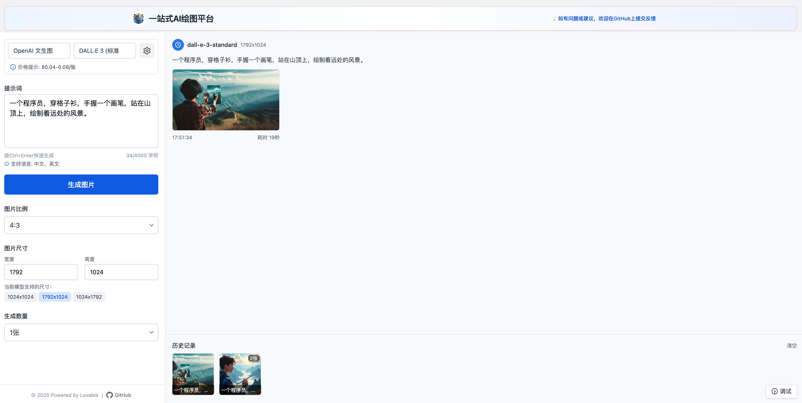

# PaintBot Hub

一个集成多个AI绘画平台API的统一操作界面网页，让创作变得更简单。



快速试用：[https://paintbot-hub.lovable.app/](https://paintbot-hub.lovable.app/)

更多的介绍查看 [PaintBot Hub: 一站式AI绘画平台大集成](https://gameapp.club/post/2025-04-24-paintbot-hub/)

## 功能特点

### 🛠 核心功能
- 文本生成图片(Text to Image)
- 支持中文、英文等多语言提示词
- 自定义图片尺寸和比例(支持4:3等多种比例)
- 批量生成多张图片(最多6张)
- 历史记录查看和复用

### 🎨 支持的AI平台

2026-10-04 根据各供应商官方 API 文档刷新。模型目录表示接口已适配；账号权限、地域、余额和预览模型可用性以实际调用为准。

| 供应商 / 官方文档 | 最新图片模型 | 保留的其他模型 |
| --- | --- | --- |
| [OpenAI](https://developers.openai.com/api/docs/guides/image-generation) | `gpt-image-2.5-sunburst`、`gpt-image-2.5-flare` | `gpt-image-2`、`gpt-image-1.5`、`gpt-image-1-mini`、GPT Image 1 高/中/低质量 |
| [智谱](https://docs.bigmodel.cn/cn/guide/models/image-generation/glm-image) | `glm-image` | `cogview-4-250304`、`cogview-4`、`cogview-3-flash`、`cogview-3` |
| [阿里云百炼](https://help.aliyun.com/zh/model-studio/text-to-image) | `qwen-image-3.0-pro`、`qwen-image-3.0`、`qwen-image-2.1-pro`、`wan2.7-image-pro`、`wan2.7-image` | Qwen Image 2.0 Pro（含 2026-06-22 快照）/2.0/Max/Plus、`qwen-image`、`wan2.6-image`、`wan2.6-t2i`、`wan2.2-t2i-flash`、Wanx 2.1/2.0、`z-image-turbo` |
| [百度千帆](https://cloud.baidu.com/doc/qianfan-api/s/Imo9g5a6a) | `ernie-image-turbo` | `irag-1.0`、`flux.1-schnell` |
| [火山方舟](https://docs.volcengine.com/docs/ark/seedream-4-0-5-0) | `doubao-seedream-5-0-flash-260915`、`doubao-seedream-5-0-pro-260628` | `doubao-seedream-5-0-lite-260128`、Seedream 4.5/4.0、旧通用 2.1/2.0 Pro/2.0 |
| [MiniMax](https://platform.minimax.cn/docs/api-reference/image-generation-t2i) | `image-01-live` | `image-01` |
| [Google Gemini](https://ai.google.dev/gemini-api/docs/image-generation) | `gemini-3.1-flash-lite-image`（Nano Banana 2 Lite）、`gemini-3.1-flash-image`（Nano Banana 2）、`gemini-3-pro-image`（Nano Banana Pro） | `gemini-2.5-flash-image` |

[DALL·E 2/3 已于 2026-05-12 停用](https://developers.openai.com/api/docs/deprecations)，已移出可选列表。旧版 Nano Banana 和 Seedream 展示 ID 仍可通过服务层映射到官方 API ID。新模型未核实的价格显示计费方式，避免把旧版本价格当作当前报价。

目前界面提供文本生成图片；上表中部分模型还支持图片编辑、参考图和组图，这些能力未在本次更新中增加。

### 💡 便捷特性
- 本地保存API密钥，确保安全性
- 生成历史记录保存
- 简洁直观的用户界面
- 实时生成状态显示
- 移动端适配支持

## 本地部署指南

### 使用Docker快速部署
你只需要在本地安装Docker，然后执行以下命令：
```bash
docker run -d -p 8080:8080 kevinlin86/paintbot-hub:latest
```
接着打开浏览器访问 `http://localhost:8080` 即可。

### 使用docker-compose
你可以本地编辑一个这样的文件，或者直接打开Github代码仓库中的[docker-compose.yml](https://github.com/kevin1sMe/paintbot-hub/blob/main/docker-compose.yml)文件并复制过来。

参考`env.example`文件创建一个`.env`文件，修改其中的环境变量。KEY等写不写无所谓，若服务对外开放建议不写。

支持的环境变量：
- `PORT`: 服务端口（默认8080）
- `OPENAI_API_KEY`: OpenAI API密钥
- `OPENAI_API_BASE_URL`: OpenAI API基础URL（可选）
- `ZHIPU_API_KEY`: 智谱AI密钥
- `BAIDU_API_KEY`: 百度千帆密钥
- `ALIYUN_WANX_KEY`: 阿里云通义万相密钥
- `ALIYUN_WANX_BASE_URL`: 可选，百炼 API 地址；默认 `https://dashscope.aliyuncs.com/api/v1`。使用新模型或其他地域时可填写控制台给出的 `https://<WorkspaceId>.<region>.maas.aliyuncs.com/api/v1`
- `ARK_API_KEY`: Seedream 使用的火山方舟 API Key
- `VOLCENGINE_KEY`: 旧版火山通用模型密钥（格式：AccessKey:SecretKey）；界面手填 Seedream 密钥时填写 Ark API Key
- `GEMINI_API_KEY`: Google Gemini API密钥
- `MINIMAX_API_KEY`: MiniMax 国际站 API密钥（调用 `api.minimax.io`）
- `PROXY_URL`: 代理设置（可选）

```yaml
services:
  paintbot:
    image: kevinlin86/paintbot-hub:latest
    container_name: paintbot
    env_file:
      - .env
    ports:
      - "${PORT:-8080}:8080"
    restart: unless-stopped
```
然后执行命令`docker-compose up -d`，接着打开浏览器访问 `http://localhost:8080` 即可。
更多的使用以及未来可能的更新，可以参考[Github项目](https://github.com/kevin1sMe/paintbot-hub)。

## 网页使用指南

1. 首次使用需要配置API密钥
   - 点击设置图标
   - 输入对应平台的API密钥
   - 密钥会安全地保存在本地

2. 生成图片
   - 选择想要使用的AI模型
   - 输入图片描述文本
   - 选择图片尺寸和比例
   - 设置生成数量
   - 点击"生成图片"按钮

3. 查看历史记录
   - 在底部历史记录区域可以查看之前生成的图片
   - 点击历史记录可以快速复用之前的设置

## 开发指南

### 技术栈
- 前端框架：React 18 + Vite
- UI组件：shadcn/ui
- 样式：Tailwind CSS
- 状态管理：React Hooks + Context
- 构建工具：Vite
- 类型系统：TypeScript

### 项目结构
```
src/
  ├── components/     # UI组件
  ├── services/      # API服务
  ├── hooks/         # 自定义Hooks
  ├── lib/           # 工具函数
  └── pages/         # 页面组件
```

### 编译&运行
1. 克隆项目
```bash
git clone https://github.com/kevin1sMe/paintbot-hub.git
cd paintbot-hub
```

2. 安装依赖
```bash
npm install
```

3. 启动开发服务器
```bash
npm run dev
```

### 模型验证

```bash
npm test          # 使用模拟 HTTP 响应验证模型 ID、请求协议、尺寸和响应解析，不计费
npm run build
npm run lint
npm run test:live # 使用环境变量中的 Key 对刷新模型各生成一张图片，会产生 API 费用
```

实际出图测试调用应用中的同一套 provider，下载图片并检查 PNG/JPEG/WebP 文件标识。没有 Key 的供应商会跳过；失败会返回非零退出码。图片和脱敏结果保存在 Git 忽略的 `.local/model-smoke-*/`，不会保存密钥。

通过 `LIVE_MODELS=qwen-image-3.0-pro,wan2.7-image-pro npm run test:live` 可缩小测试范围；`LIVE_MODELS=all` 测试整个模型目录。凭据仅接受环境变量，不读取用户浏览器存储；百炼须使用按量付费 API Key，不能使用 Coding/Token Plan 密钥。

2026-10-04 实测刷新范围中的 29 个模型：17 个成功出图（智谱 1、百炼 13、Gemini 3），并下载后验证图片解码；10 个未成功，2 个因缺少 MiniMax Key 跳过。OpenAI 模型发现成功，但项目余额耗尽；Seedream Key 未激活；百度 ERNIE Image Turbo 返回模型无访问权限或不存在；`wan2.6-image` 异步调用遇到网络超时，尚未验证实际出图。其余保留的旧模型未在本次实测范围中。

代码验证：28 项服务层回归测试、9 项浏览器模型/尺寸选择、3 项旧偏好迁移及七家供应商的模拟生成/历史记录流程通过；生产构建、TypeScript、lint 和 Docker 运行时变量替换验证通过。浏览器回归可在启动开发服务后用 `playwright-cli run-code --filename=tests/ui-models.js` 运行。

## 贡献指南
欢迎提交 Issue 和 Pull Request 来帮助改进项目。

## 许可证
MIT License

## 致谢
- 感谢所有为项目做出贡献的开发者
- 特别感谢 Lovable 平台的支持
